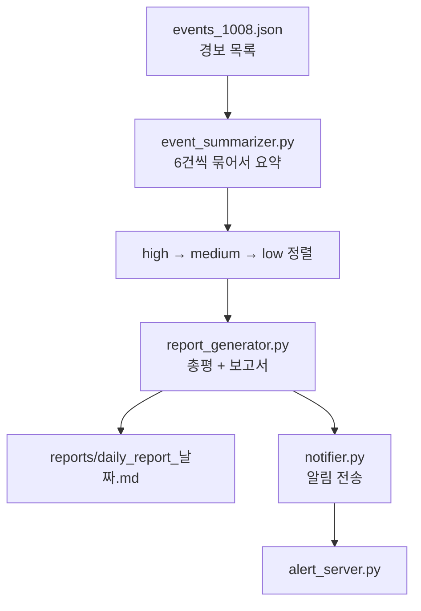

# agent_core

SKT ALEPH 1과목(10/2 ~ 10/8) 실습 폴더.

최종으로 만든 건 **보안 경보를 요약해 보고서로 저장하고 알림까지 보내는 프로그램**이다.
경보를 Gemini 로 요약하고, 위험한 것부터 정렬해서 보고서(md)로 저장한 뒤, 알림 서버로 한 줄 보낸다.

## 흐름



`pipeline.py` 가 이걸 순서대로 부른다. 모델 이름, 저장 폴더, 알림 주소는 `config.json` 에서 읽음.

정한 규칙
- 숫자(건수, high 개수)는 코드가 센다. LLM 은 요약이랑 총평 문장만 씀
- LLM 답을 못 읽거나 알림 서버가 꺼져 있어도 멈추지 않는다
- high 경보는 "사람 확인 필요"로 따로 센다

## 실행

```bash
pip install flask requests schedule
```

1. `.env` 에 키를 적는다 (`GEMINI_API_KEY=내키`). `.env` 는 올리지 않음
2. 터미널 하나에서 `python alert_server.py`
3. 다른 터미널에서 `agent_core` 로 이동한 뒤 `python pipeline.py`

무료 키는 1분에 15번까지라서 429 나오면 1분 기다렸다가 다시 하면 된다.

## 파일

노트북이 이 폴더 안에 파일을 만드는 방식이라 폴더를 나누지 않고 한곳에 둠.

**노트북 (날짜순)**
- `261002_am_webhook_cli` 웹훅 서버, curl, argparse
- `261002_pm_trigger_scheduler` 트리거/조건/액션, 중복 알림 막기, 스케줄러
- `261006_am_llm_prompt` LLM API 호출, 프롬프트, JSON 답 읽기
- `261006_pm_agent_tools` 도구 호출, 라우터, 승인 게이트
- `261007_am_report_summary` 묶음 요약, 위험도 정렬
- `261007_pm_report_generator` 총평, 보고서 틀, high 3건 이상이면 경고
- `261008_am_config_pipeline` config.json 분리, 알림 연동, 하나로 잇기
- `261008_pm_review_debug_retro` 코드 리뷰, 테스트, 디버깅, 회고

**최종 프로그램**
- `pipeline.py` 시작점
- `llm_client.py` Gemini 호출, 답에서 JSON 꺼내기
- `event_summarizer.py` 묶음 요약, 위험도 정렬
- `report_generator.py` 총평, 보고서 만들기, 저장
- `notifier.py` 설정 검사, 사람 확인 판정, 알림 보내기
- `alert_server.py` 알림 받는 서버 (5001번 포트)
- `config.json` 설정 / `config_broken.json` 키 빠진 설정 / `config_off.json` 꺼진 알림 주소 (둘 다 테스트용)

**그 전에 만든 것**
- `tool_router.py` 에이전트 도구 2개 (로그인 실패 세기, IP 조회) + 라우터
- `scheduler_job.py` 몇 초마다 로그 검사, 실패 3회 이상 계정 찾기, 보낸 건 다시 안 보냄
- `webhook_server.py`, `webhook_server_pm.py` 경보 받는 서버 (포트를 `--port` 로 받음)
- `hello_server.py` → `echo_server.py` → `count_server.py` → `save_server.py` 웹훅 서버 단계별 연습
- `port_demo.py`, `rule_demo.py`, `notype_demo.py` argparse 연습
- `test_webhook.sh`, `demo_test.sh` curl 로 경보 보내 보기

**데이터 / 결과**
- `raw_logs.txt` → `normalized_logs.json` 원본 로그랑 정리한 로그
- `events_1007.json`, `events_1008.json` 실습용 경보
- `event_summaries.json`, `sorted_summaries.json` 요약 결과, 정렬 결과
- `daily_report_*.md`, `report_test.md` 수업 중에 만든 보고서
- `received_alerts.json`, `processed_ids.json`, `demo_ids.json`, `agent_result.json` 실습 중에 생긴 기록

## 어려웠던 것

함수 구성이랑 함수끼리 어떻게 이어지는지 이해하는 게 제일 어려웠다.
`pipeline.py` 하나 실행하면 안에서 파일 4개 함수가 차례로 불리는데, 어디서 뭐가 넘어가는지 따라가는 데 시간이 걸림.

## 고친 것

- 코드에 박혀 있던 모델 이름을 `config.json` 으로 뺌
- `config.json` 에 `report_folder` 가 있는데 실제로는 안 쓰이고 있었음. 보고서가 `reports/` 에 저장되게 고침
- `__pycache__` 랑 쓸모없는 파일 정리, `.gitignore` 추가

## 다음에 해볼 것

- 이 프로그램이 보내는 알림을 텔레그램 봇으로 실제로 받아 보기 (캡스톤)
