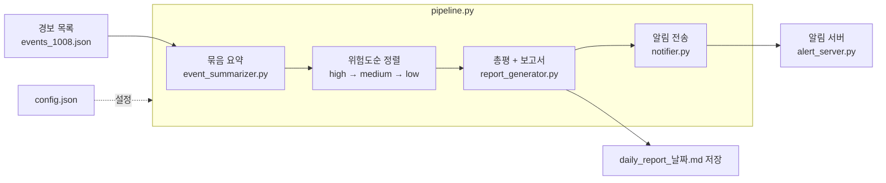

# agent_core

밤사이 쌓인 보안 경보를 **LLM(대형 언어 모델, 여기서는 Gemini)으로 요약하고, 위험한 것부터 정리한 보고서를 만들어 알림까지 보내는** 작은 관제 에이전트입니다.
SKT ALEPH 과정에서 2026년 10월 2일부터 10월 8일까지 실습하며 만든 노트북과 코드를 모아 두었습니다.

## 전체 흐름



- **숫자는 코드가, 문장은 LLM이** 씁니다. 건수와 high 개수는 코드가 직접 세고, LLM에게는 요약과 총평 문장만 맡깁니다.
- **실패해도 멈추지 않습니다.** LLM 답을 못 읽으면 그 묶음만 건너뛰고, 알림 서버가 꺼져 있어도 보고서는 저장됩니다.
- **위험한 건은 사람이 확인합니다.** `config.json`의 `approve_severity` 이상인 경보는 "사람 확인 필요"로 셉니다.

## 날짜별 학습 노트북

| 노트북 | 주제 | 이때 만든 파일 |
|---|---|---|
| `261002_am_webhook_cli.ipynb` | 웹훅(다른 프로그램이 보내는 알림)을 받는 서버, `curl`, `argparse` | `hello_server.py`, `echo_server.py`, `webhook_server.py`, `test_webhook.sh` |
| `261002_pm_trigger_scheduler_ipynb.ipynb` | 트리거·조건·액션, 같은 알림 중복 막기(멱등성), 정해진 간격마다 실행(스케줄러) | `scheduler_job.py`, `processed_ids.json` |
| `261006_am_llm_prompt.ipynb` | LLM을 API로 호출하기, 프롬프트로 답의 모양 정하기, JSON 답 안전하게 읽기 | `llm_client.py` |
| `261006_pm_agent_tools.ipynb` | AI 에이전트의 도구 호출, 이름으로 함수 찾기(라우터), 위험한 도구 앞의 승인 게이트 | `tool_router.py` |
| `261007_am_report_summary.ipynb` | 마크다운 보고서 형식, 경보를 묶음으로 나눠 요약, 위험도순 정렬 | `event_summarizer.py` |
| `261007_pm_report_generator.ipynb` | 요약을 다시 요약한 총평, 보고서 틀, high 3건 이상이면 경고 | `report_generator.py` |
| `261008_am_config_pipeline.ipynb` | 설정을 `config.json`으로 분리, 알림 연동, 전체를 하나로 잇기 | `notifier.py`, `pipeline.py`, `config*.json` |
| `261008_pm_review_debug_retro.ipynb` | 코드 리뷰, 단위 테스트(`assert`), 디버깅, 1과목 회고 | (앞의 파일을 점검하고 고침) |

## 파일 안내

### 완성본 (파이프라인을 이루는 파일)

| 파일 | 하는 일 |
|---|---|
| `pipeline.py` | 시작점. 설정 읽기 → 보고서 만들기 → 사람 확인 건수 세기 → 알림을 차례로 부릅니다 |
| `llm_client.py` | `.env`에서 `GEMINI_API_KEY`를 찾아 Gemini를 호출하고(`call_llm`), 답에서 JSON을 꺼냅니다(`parse_llm_json`) |
| `event_summarizer.py` | 경보를 6건씩 묶어 요약(`summarize_events`)하고, high → medium → low 순으로 정렬(`sort_by_risk`)합니다 |
| `report_generator.py` | 총평을 받고(`make_overview`), 보고서 문자열을 만들고(`build_report`), `daily_report_YYYYMMDD.md`로 저장(`save_report`)합니다 |
| `notifier.py` | 설정에 꼭 필요한 키 4개가 있는지 검사하고, 사람 확인이 필요한 위험도인지 판정하고, 알림을 보냅니다 |
| `alert_server.py` | 알림을 받아 터미널에 보여 주는 서버 (포트 5001, 주소 `/alert`) |
| `tool_router.py` | 에이전트 도구 2개(로그인 실패 세기, IP 나라·통신사 조회)와 이름으로 도구를 찾아 실행하는 라우터 |
| `scheduler_job.py` | 몇 초마다 로그를 검사해 로그인 실패 3회 이상인 계정을 찾고, 이미 보낸 경보는 다시 보내지 않습니다 |

### 설정 파일

| 파일 | 용도 |
|---|---|
| `config.json` | 정상 설정 (모델, 사람 확인 기준 `high`, 보고서 폴더, 알림 주소) |
| `config_broken.json` | 키가 빠진 설정. 파이프라인이 멈추고 빠진 키를 알려 주는지 확인하는 용도 |
| `config_off.json` | 꺼진 포트(5999)로 알림을 보내는 설정. 알림이 실패해도 멈추지 않는지 확인하는 용도 |

### 연습용 서버와 스크립트

| 파일 | 내용 |
|---|---|
| `hello_server.py`, `echo_server.py`, `count_server.py`, `save_server.py` | 웹훅 서버를 단계별로 키워 간 연습 (출력 → 되돌려주기 → 개수 세기 → 파일 저장) |
| `webhook_server.py`, `webhook_server_pm.py` | 포트를 `--port`로 받는 웹훅 서버 완성본 |
| `port_demo.py`, `rule_demo.py`, `notype_demo.py` | `argparse` 연습 (`type=int`를 빼면 숫자가 글자로 붙는 것까지) |
| `test_webhook.sh`, `demo_test.sh` | `curl`로 서버에 경보를 보내 보는 스크립트 |

### 데이터와 결과물

| 파일 | 내용 |
|---|---|
| `raw_logs.txt` → `normalized_logs.json` | 원본 로그와, 그것을 시간·등급·계정·IP로 정리한 것 |
| `events_1007.json`, `events_1008.json` | 실습에 쓴 야간 경보 목록 (`id`, `rule`, `target`, `time`, `detail`) |
| `event_summaries.json`, `sorted_summaries.json` | LLM 요약 결과와, 그것을 위험도순으로 정렬한 것 |
| `daily_report_2026100*.md` | 파이프라인이 만든 보고서 |
| `received_alerts.json`, `processed_ids.json` | 웹훅 서버가 받은 경보, 이미 보낸 경보 ID 기록 |

## 실행 방법

```bash
pip install flask requests schedule
```

1. `agent_core` 폴더나 그 위 폴더(다섯 칸 위까지)에 `.env` 파일을 만들고 한 줄을 적습니다. **이 파일은 저장소에 올리지 않습니다.**
   ```
   GEMINI_API_KEY=여기에_내_키
   ```
2. 터미널 하나에서 알림 서버를 켭니다.
   ```bash
   python alert_server.py
   ```
3. 다른 터미널에서 파이프라인을 돌립니다. `agent_core` 폴더 안에서 실행해야 경보 파일을 찾습니다.
   ```bash
   python pipeline.py
   ```

무료 키는 1분에 15번까지만 호출할 수 있습니다. 상태 코드 429가 나오면 1분 기다렸다가 다시 실행하세요.

## 정리할 거리

- `config.json`의 `report_folder`는 아직 쓰이지 않습니다. 보고서는 지금 폴더에 바로 저장됩니다.
- `filename`(확장자 없는 보고서 샘플)과 `agent_result.json`(빈 파일)은 실습 중에 생긴 파일로 보입니다.
- `__pycache__/`는 파이썬이 자동으로 만드는 폴더라 저장소에 올리지 않아도 됩니다.
